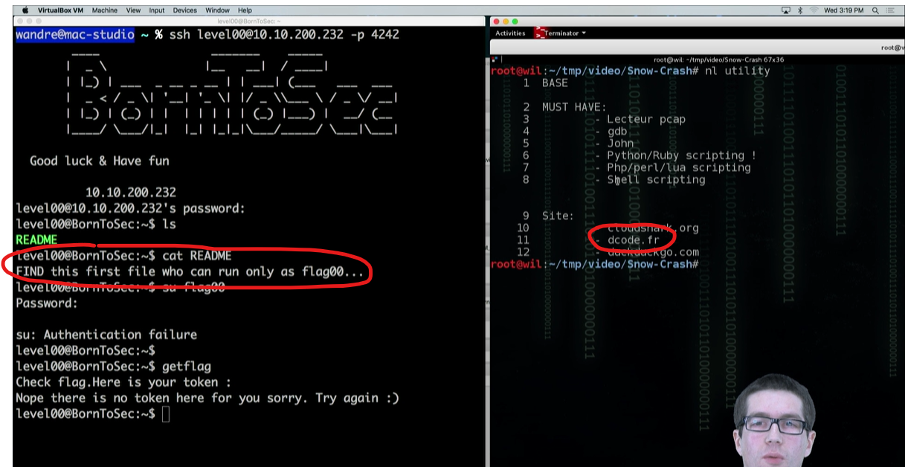
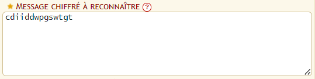
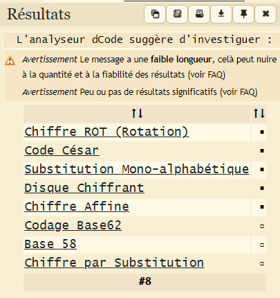
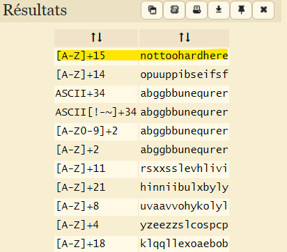

# Hint
There is hints in the presentation video of the project :
1. Use Find
2. Use < list of sites >



# Use Hint #1

## Some Fails

```sh
find / -name "*flag*" 2> /dev/null | less
find / -name "*level*" 2> /dev/null | less
find / -name "*snow*" 2> /dev/null | less
find / -name "*crash*" 2> /dev/null | less
find / -name "*Crash*" 2> /dev/null | less
find / -perm 777 2> /dev/null | less
```

## Find something

```sh
level00@SnowCrash:~$ find / -user flag00 2> /dev/null
/usr/sbin/john
/rofs/usr/sbin/john
```

## Cat the files

```sh
level00@SnowCrash:~$ cat /usr/sbin/john && cat /rofs/usr/sbin/john
cdiiddwpgswtgt
cdiiddwpgswtgt
```

## Test as password

```sh
su flag00
Password: "cdiiddwpgswtgt"
su: Authentication failure
```

# Use Hint #2

## Identify the encryption algo: 
https://www.dcode.fr/identification-chiffrement




## Decipher
https://www.dcode.fr/chiffre-rot



# Log to Flag00 and get the flag !

```sh
level00@SnowCrash:~$ su flag00
Password: "nottoohardhere"
Don t forget to launch getflag !
flag00@SnowCrash:~$ getflag
Check flag.Here is your token : x24ti5gi3x0ol2eh4esiuxias
```


