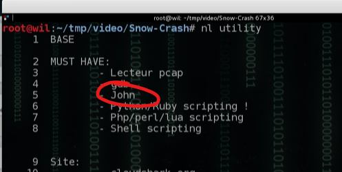

# Good start ...

```sh
level01@SnowCrash:~$ ls -la
total 12
dr-x------ 1 level01 level01  100 Mar  5  2016 .
d--x--x--x 1 root    users    340 Aug 30  2015 ..
-r-x------ 1 level01 level01  220 Apr  3  2012 .bash_logout
-r-x------ 1 level01 level01 3518 Aug 30  2015 .bashrc
-r-x------ 1 level01 level01  675 Apr  3  2012 .profile
```
(nothing with find neither)


# Let's be "logic"

We want to connect to the flag01 to get the flag, but we don't have the password.

It must be encrypted, but let's see where it's stored :

## What a coincidence

```sh
level01@SnowCrash:~$ cat /etc/passwd
root:x:0:0:root:/root:/bin/bash
[...]
flag00:x:3000:3000::/home/flag/flag00:/bin/bash

flag01:42hDRfypTqqnw:3001:3001::/home/flag/flag01:/bin/bash

flag02:x:3002:3002::/home/flag/flag02:/bin/bash
[...]
flag14:x:3014:3014::/home/flag/flag14:/bin/bash
```

flag01's password is not hidden but hashed

## Use "John the Ripper"

Like recommended in the video



John give us: `"42hDRfypTqqnw" -> "abcdefg"`

(log to flag01 with "abcdefg" and getflag...)
