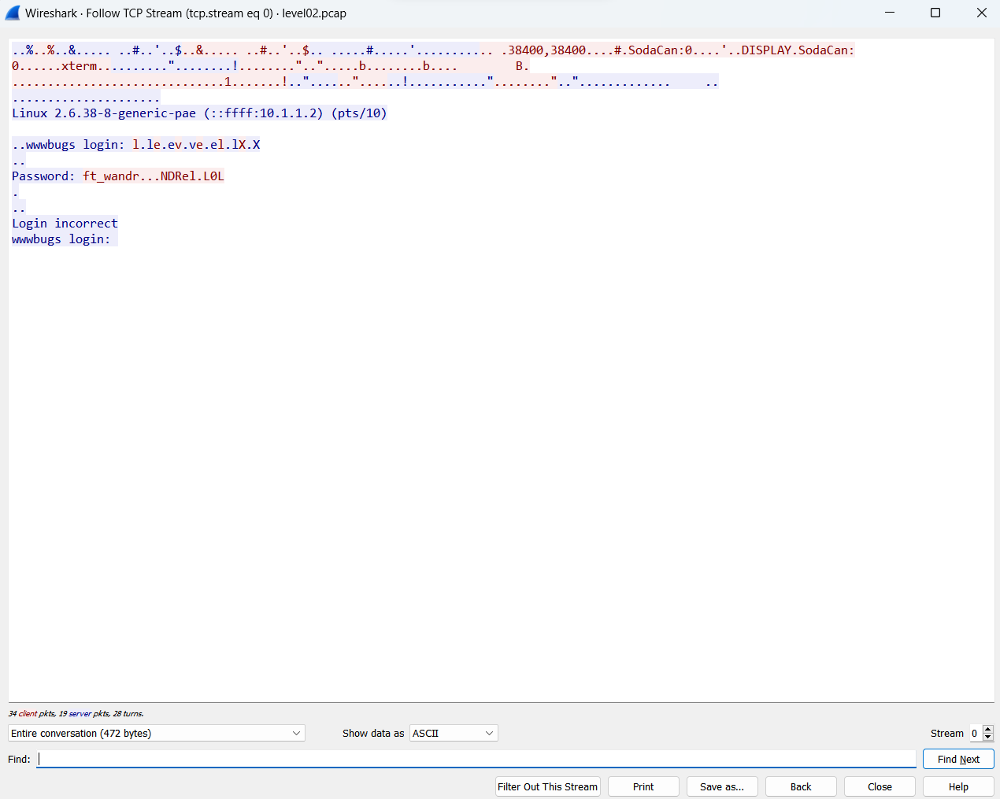
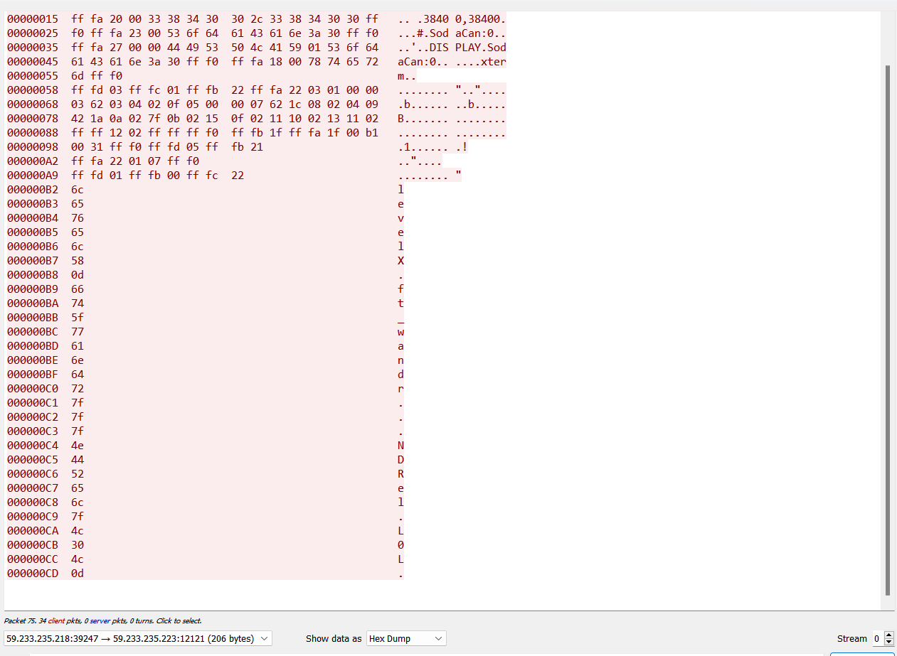

# Real good start

```sh
level02@SnowCrash:~$ ls
level02.pcap
```

the pcap files can be read by wireshark so...

# Transfer to read

I transfer from the VM to my host to read with wireshark

`scp -P 4242 -r level02@192.168.0.23:/home/user/level02/level02.pcap .`

# Read with wireshark

After the file opened we can do :

`Analyse > Follow > TCP Stream` (or Ctrl+Alt+Shift+T)

And we got that :



It's mark as incorrect but let's try.

The password as none-printable char represented by dots.

So we check the hex

We filter to show only the client who send his password en we show data as Hex Dump :



We can see that all the dots or 7f, DEL char in ASCII tab so :

`ft_wandr...NDRel.L0L` become `ft_waNDReL0L`

That the flag02 password you know the rest